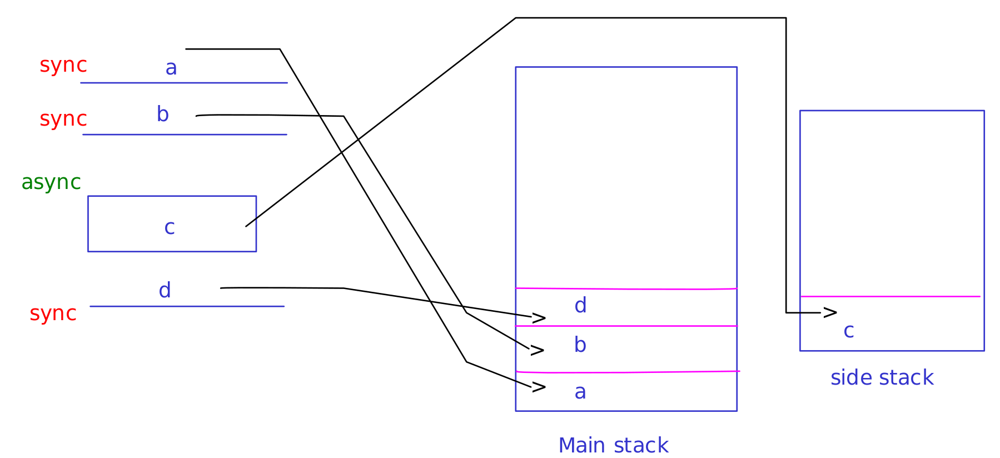
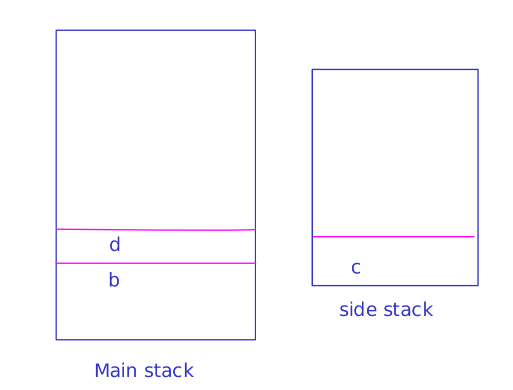
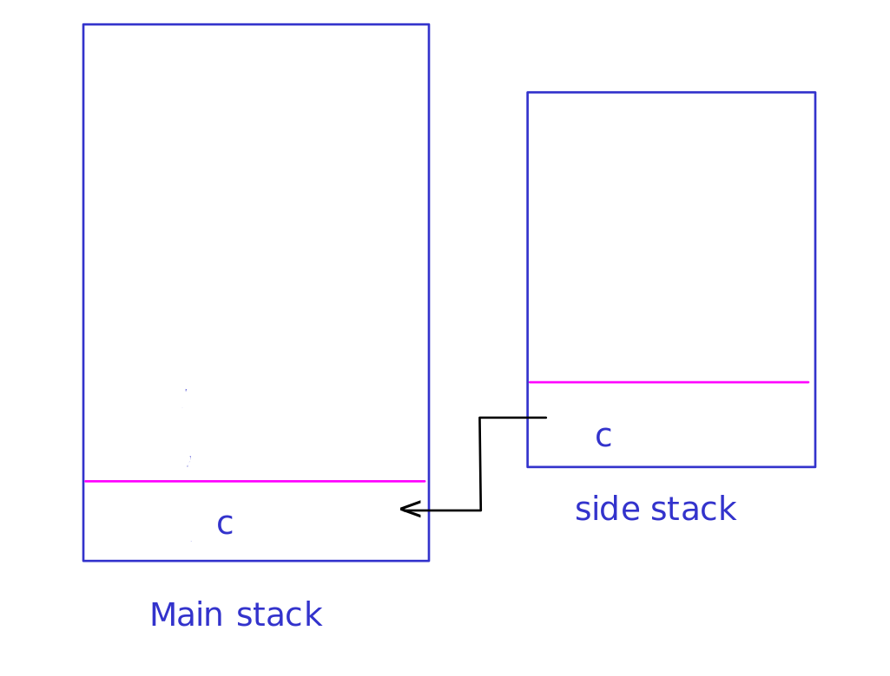

### What is Sync and Async? (synchronous & asynchronous) ✅

**Sync** means one after another. Until the previous task or command gets completed, the next one doesn't start.

**Async** means starting all tasks or commands at the same time and getting the result from the task that finishes first.

#### How to know that we are writing sync or async code?

```javascript
setTimeout();
setInterval();
Promise;
fetch();
axios;
XMLHttpRequest;
```

If we are using above things in our code, then its asynchronous code, otherwise sync.

### What is async JS? ✅

Many times our final code depends on a server, so we don't know when will we get our response or answer from the server, in such cases we can't write synchronous code. To deal with that we write asynchronous code so that blocking doesn't happen and whenever we get the response, the code get executed in respect to the answer.

eg.:

```javascript
setTimeout(callback, timeinms);
```

Whatever we write inside the callback function it will run after the time mentioned time.

#### Callback function

Callback function are normal functions, just because they are called after a certain period they are called _callback function_.

In async code, callback function always gets executed at a later point in time, often after a certain event or process has completed or after getting the answer.

```javascript
console.log("This line got printed...");
setTimeout(function () {
  console.log("Now after 3 seconds this line also got printed...");
}, 3000);
```

### JS is not asynchronous!!!

Main stack => execution

#### asynchronous behavior in JavaScript

(Whatever is inside main stack that outputs and whatever is inside side stack (Task queue) that can do processing behind the scene and when the processing get completed it will be brought to the main stack and run there.)

Synchronous code always moves to Main stack (call stack), and Asynchronous code moves to side stack (Task queue)

When

When main stack is empty, then only side stack will be checked, and if processing is completed and answer or response has come then only it will be moved to the main stack.


#### Event loop

The communication between main stack and task queue is done by Event loop.
The event loop is a mechanism that allows JavaScript to handle multiple tasks concurrently without blocking the main program. It continually checks for pending tasks in the event queue and processes them one by one, making JavaScript suitable for handling asynchronous operations like user interactions and network requests

```javascript
console.log("First");
console.log("Second");
setTimeOut(function () {
  console.log("Third");
}, 0);
console.log("Fourth");
```

<!-- ### Whole story of Async -->

<!-- ### Single threading and multi threading -->

### Callbacks => functions

callbacks are functions that runs after completion of async code.

Async has two parts:

1. to write async code:
   fetch,
   XMLHttpRequest,
   axios,
   promises,
   settimeout,
   setinterval

2. to run the answers that we get from the request:
   callbacks,
   then, catch,
   async, await

### Promises in JavaScript

When we write code that may take time to complete in the future. So we never know how much time it may take us to get a response. In such scenarios we use Promises, which is a JavaScript construct, whose main purpose is to return us a response whenever the code execution is complete.

The code can be in 3 states only:

1. Pending: When the task is still in progress.
2. Resolve: When the task successfully completes and returns a result.
3. Reject: When the task encounters an error or fails.

Promises are essential for ensuring that we receive a response, whether it's a successful result (resolve) or an error notification (reject), once the asynchronous operation is done executing.

i. first go home
ii. open the gate and close it
iii. cook and eat
iv. go to sleep

To keep them in order in async

```javascript
var ans = new Promise(function (res, rej) {
  return res("first go home");
});

var p2 = ans.then(function (data) {
  console.log(data);
  return new Promise(function (res, rej) {
    return res("open the gate and close it");
  });
});

var p3 = p2.then(function (data) {
  console.log(data);
  return new Promise(function (res, rej) {
    return res("cook and eat");
  });
});

var p4 = p3.then(function (data) {
  console.log(data);
  return new Promise(function (res, rej) {
    return res("go to sleep");
  });
});

p4.then(function (data) {
  console.log(data);
});
```

### async await

In JavaScript, when dealing with asynchronous code, we often use Promises. After the async operation is resolved, we can use _.then()_ to execute the next part of the code. An alternative to this approach is to use _async/await_, which offers a more concise and synchronous-like way to write asynchronous code. _async/await_ is often preferred in modern JavaScript development for its readability and ease of use.

Using .then():

```javascript
function abcd(){
  fetch(`https://randomuser.me/api/`)
  .then(function(raw){
    return raw.json();
  })
  .then(function(data)){
    console.log(data)f;
  }
}
```

Alternatively using async/await:

```javascript
async function abcd() {
  let raw = await fetch(`https://randomuser.me/api`);
  let ans = await raw.json();
  console.log(ans);
}
```

Real world use cases:
To write db in node
fetch
settimeout
setinterval

### Concurrency:

Concurrency in JavaScript: Concurrency in JavaScript refers to the simultaneous execution of both synchronous (sync) and asynchronous (async) code. In a JavaScript environment like a web browser or Node.js, you have a single-threaded event loop that manages the execution of code.

Here's a breakdown of how it works:

Main Stack: This is where the synchronous code (e.g., function calls, variable assignments) is executed. The main stack follows a first-in, first-out (FIFO) order.

Task Queue (also known as Callback Queue): This is where asynchronous tasks (e.g., callbacks, promises) are placed once they are completed and ready to be executed. These tasks are queued up and wait for their turn to enter the main stack.

Event Loop: The event loop continuously checks if the main stack is empty. When it is, the event loop looks at the task queue and moves tasks from the task queue to the main stack one by one, following the FIFO order.

### Parallelism:
